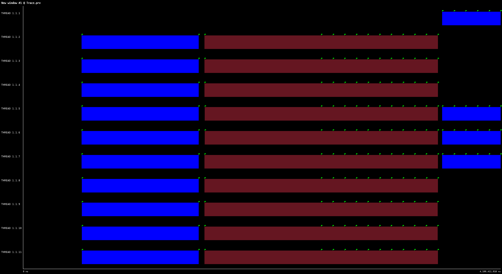
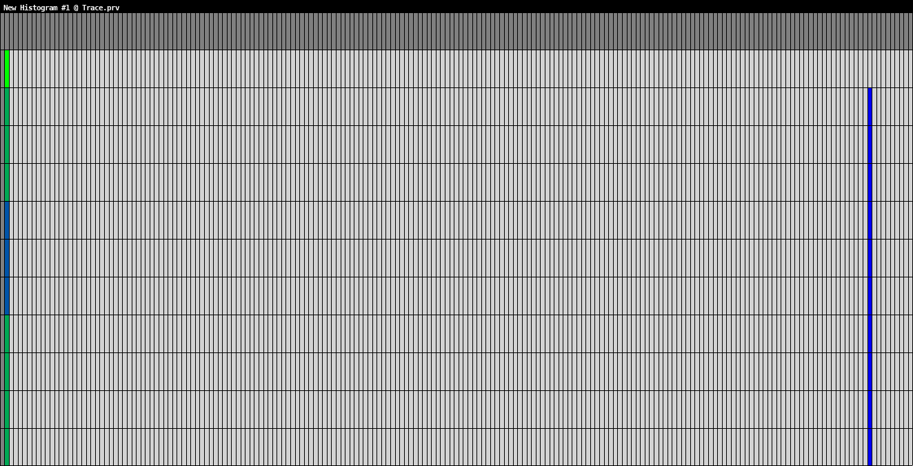
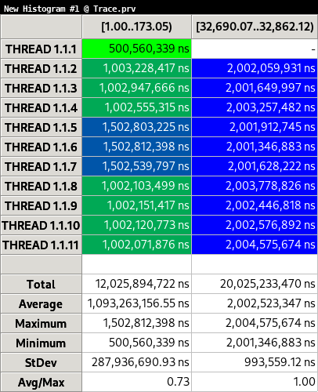
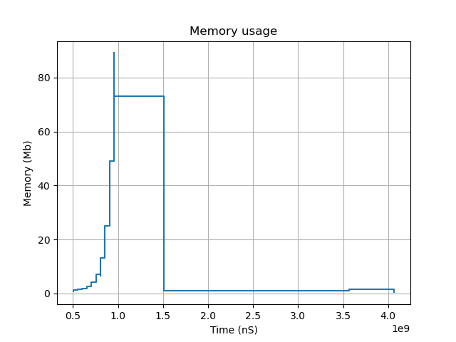

Readme
=======

This is a very simple multi-platform Instrument based profiler
intended to work in multi-threaded systems (not intended for
distributed memory systems). For more advanced use cases consider
using [Extrae](https://tools.bsc.es/extrae) instead of this.

The main goal is to make it portable into MSWindows and GNU/Linux
systems with a very minimal implementation and support for
multi-threading. Basically because that's what I need ATM.

Everything in a single header to include without requiring extra
shared/dynamic libraries.

Unlike sampler profiler this is an instrumentation profiler intended
to work minimizing the overhead and execution perturbation, and
providing more accurate numbers for system call counters.

Limitations
-----------

- As this is intended to be multi-platform it is not possible to use
function interception in a portable way.

- Due to the nature of the implementation sometimes the trace files
  may become too big; causing some issues with the resulting sizes.

- It is intended to work only with C++ because it relies on RAII and
  static thread local storage constructors and destructors.

The basic steps are:
--------------------

1. Instrument the code like in the `main.cpp` example code.

	The example code includes all the different alternatives to instrument the code.

	It is very important to define the `PROFILER_ENABLED` macro **BEFORE** including the 
	`Profiler.hpp` header.

		- PROFILER_ENABLED = 0 (or not defined) don't trace anything
		- PROFILER_ENABLED = 1 Emit user defined events (function defined instrumentation and thread init-stop)
		- PROFILER_ENABLED = 2 Like 1 + dynamic memory allocation events (intercept new and delete)

2. Execute your program. This will create a directory called `TRACEDIR_<timestamp>` in the current execution path

   The directory contains the traces (in binary format) and some text files with
   information for the paraver viewer (`Trace.pcf` and `Trace.row`).

3. Process the Traces with the parser executable.

	```
	./Parser.x TRACEDIR_<timestamp>
	```

	This will create a [Paraver](https://tools.bsc.es/paraver) trace file:

	```
	TRACEDIR_<timestamp>/Trace.prv
	```

You can open that file with wxparaver.


Instrumenting code
------------------

At the moment the events are stored in `uint16_t` types, so the events
must be in the range: 1-65535.

- 0 Don't use it!!
- 1 - 32767 User events manually defined, the user can use any of them.
- 32768 - 65536 Are reserved for auto-registered functions and internal
  At the moment there are only 3 predefined events values:
	  * 32768 Thread status
	  * 32769 Memory allocations
	  * 32770 Memory deallocation

Trace example
-------------

The Profiler generates the traces in binary format. With a very simple
format it is very easy to generate files for visualizer or data
analyzers.

The profiler generates one trace file / thread and main is generally
in thread 0. For more details about how to parse a trace you can read
the code in `Parser.cpp`.

For the example provided in the `main.cpp` the paraver trace looks like:



Paraver y capable to perform some simple data analysis like generate
histograms.





When PROFILER_ENABLED = 2 the heap memory allocations are tracked by
intercepting the `new` and `delete` operators.

With that information we can build the memory usage graph withing
`Paraver` or with the provided `memory.py` script.


