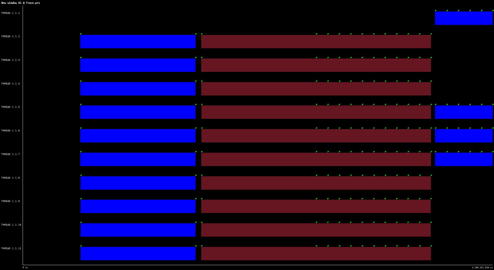
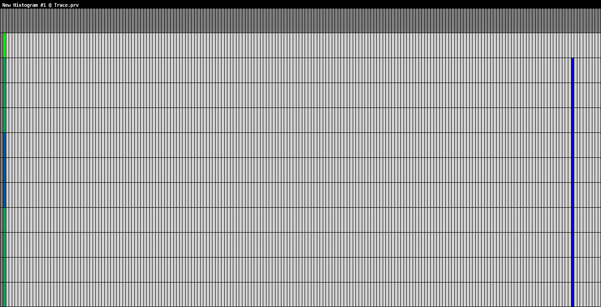
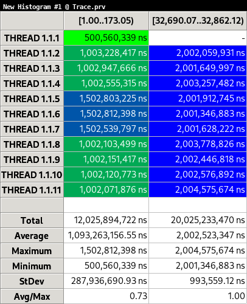

Readme
=======

[](https://github.com/Ergus/ExtraeWin/actions/workflows/cmake.yml)
[](https://coveralls.io/github/Ergus/ExtraeWin?branch=master)
[](https://www.gnu.org/licenses/gpl-3.0)

This is a very simple multi-platform Instrument based profiler
intended to work in multi-threaded systems (not intended for
distributed memory systems). For more advanced use cases consider
using [Extrae](https://tools.bsc.es/extrae) instead of this.

The main goal is to make it portable into MSWindows and GNU/Linux
systems with a very minimal implementation and support for
multi-threading. Basically because that's what I need ATM.

Everything in a single header to include without requiring extra
shared/dynamic libraries.

Unlike sampler profiler this is an instrumentation profiler intended
to work minimizing the overhead and execution perturbation, and
providing more accurate numbers for system call counters.

Limitations
-----------

- As this is intended to be multi-platform it is not possible to use
function interception in a portable way.

- Due to the nature of the implementation sometimes the trace files
  may become too big; causing some issues with the resulting sizes.

- It is intended to work only with C++ because it relies on RAII and
  static thread local storage constructors and destructors.

The basic steps are:
--------------------

1. Instrument the code like in the `tests/tests_profiler.cpp` example code.

	The example code includes all the different alternatives to instrument the code.

	It is very important to define the `PROFILER_ENABLED` macro **BEFORE** including the
	`Profiler.hpp` header.

		- PROFILER_ENABLED = 0 (or not defined) don't trace anything
		- PROFILER_ENABLED > 0 Emit user defined events (function instrumentation and thread init/stop)

2. Execute your program. This will create a directory called `TRACEDIR_<timestamp>_<pid>` in the current execution path.

   The directory contains the traces (in binary format) and some text files with
   information for the paraver viewer (`Trace.pcf` and `Trace.row`).

3. Process the traces with the parser executable.

	```
	./Parser.x TRACEDIR_<timestamp>_<pid>
	```

	This will create a [Paraver](https://tools.bsc.es/paraver) trace file:

	```
	TRACEDIR_<timestamp>_<pid>/Trace.prv
	```

You can open that file with wxparaver.


Instrumentation macros
----------------------

All macros expand to nothing when `PROFILER_ENABLED` is 0 or not defined.

### `INSTRUMENT_FUNCTION([name])`

Place at the top of a function body. Emits a begin event on entry and an end
event when the enclosing scope exits (RAII). If `name` is omitted the compiler
provided function signature is used (`__PRETTY_FUNCTION__` on GCC/Clang,
`__FUNCSIG__` on MSVC).

```cpp
void myFunction() {
    INSTRUMENT_FUNCTION();          // uses compiler signature
    INSTRUMENT_FUNCTION("myFunc");  // custom name
    ...
}
```

### `INSTRUMENT_FUNCTION_UPDATE(value[, name])`

Emits a new value on the event opened by `INSTRUMENT_FUNCTION` in the same
scope. Use it to annotate phases within a function. `value` must be != 0 and
!= 1. The optional `name` string labels the value in the PCF file; if omitted
`__FILE__:__LINE__` is used.

```cpp
void myFunction() {
    INSTRUMENT_FUNCTION();
    INSTRUMENT_FUNCTION_UPDATE(2, "init");
    ...
    INSTRUMENT_FUNCTION_UPDATE(3, "work");
    ...
}
```

### `INSTRUMENT_SCOPE(TAG, value)`

Instruments an arbitrary scope identified by `TAG` (a plain C++ identifier).
`TAG` is used as both the event name and the token that connects
`INSTRUMENT_SCOPE_UPDATE` calls to this scope. `value` must be != 0.

```cpp
for (size_t i = 0; i < n; ++i) {
    INSTRUMENT_SCOPE(iteration, 1 + i);
    ...
}
```

### `INSTRUMENT_SCOPE_UPDATE(TAG, value[, name])`

Emits a new value on the event opened by `INSTRUMENT_SCOPE(TAG, ...)` in the
same or a nested scope. Must appear after the matching `INSTRUMENT_SCOPE(TAG)`.

```cpp
INSTRUMENT_SCOPE(work, 1);
INSTRUMENT_SCOPE_UPDATE(work, 2, "phase_a");
...
INSTRUMENT_SCOPE_UPDATE(work, 3, "phase_b");
```

### `INSTRUMENT_PERF(name)` *(Linux only)*

Reads a Linux hardware or software performance counter and emits its value as
a profiler event. `name` must match one of the counter names listed below
(same names as shown by `perf list`).

A `thread_local` counter object is created once per call site per thread. The
first emission on each thread records a baseline and emits value 0; all
subsequent emissions report the **delta** since that baseline. This makes it
easy to measure the counter activity between two points in the code.

```cpp
INSTRUMENT_PERF("cpu-cycles");
doWork();
INSTRUMENT_PERF("cpu-cycles");  // emits cycles consumed by doWork()
```

If `name` is not in the supported list a `profilerError` exception is thrown
at startup. If `perf_event_open` fails at runtime (e.g. due to system
permission settings) a warning is printed to `stderr` and no events are
emitted for that counter — the rest of the trace is unaffected.

Supported hardware counters (`PERF_TYPE_HARDWARE`):

| Name | Description |
|---|---|
| `cpu-cycles` | CPU clock cycles |
| `instructions` | Instructions retired |
| `cache-references` | Last-level cache accesses |
| `cache-misses` | Last-level cache misses |
| `branch-instructions` | Branch instructions retired |
| `branch-misses` | Mispredicted branches |
| `bus-cycles` | Bus cycles |
| `stalled-cycles-frontend` | Cycles stalled in the front-end |
| `stalled-cycles-backend` | Cycles stalled in the back-end |

Supported software counters (`PERF_TYPE_SOFTWARE`):

| Name | Description |
|---|---|
| `cpu-clock` | CPU clock (high-resolution timer) |
| `task-clock` | Clock time attributed to this thread |
| `page-faults` | Total page faults |
| `context-switches` | Context switches |
| `cpu-migrations` | Times the thread migrated to a different CPU |
| `minor-faults` | Minor page faults (no disk I/O) |
| `major-faults` | Major page faults (disk I/O required) |

All counters are opened with `pid=0, cpu=-1`: the kernel attaches each event
to the calling thread and transparently saves/restores the hardware counter on
context switches and CPU migrations, so deltas always reflect only this
thread's activity regardless of which core it runs on.


Event ID ranges
---------------

Event IDs are stored as `uint16_t` (range 1–65535). Value 0 always means
*end of event* and must not be used as a user value.

- **1–32767**: reserved for auto-registered events (functions, scopes, perf
  counters). IDs are assigned in reverse order starting from 32767.
- **32768–65535**: reserved for internal profiler events.
  Currently assigned:
  * 32768 — `ThreadRunning` (thread start/stop)
  * 32769 — `mutex` (instrumented mutex contention)


Trace example
-------------

The profiler generates one binary trace file per thread. For more details
about the file format see `Parser.cpp`.

For the example provided in `tests/tests_profiler.cpp` the Paraver trace looks like:



Paraver is capable of performing simple data analysis such as generating
histograms.




